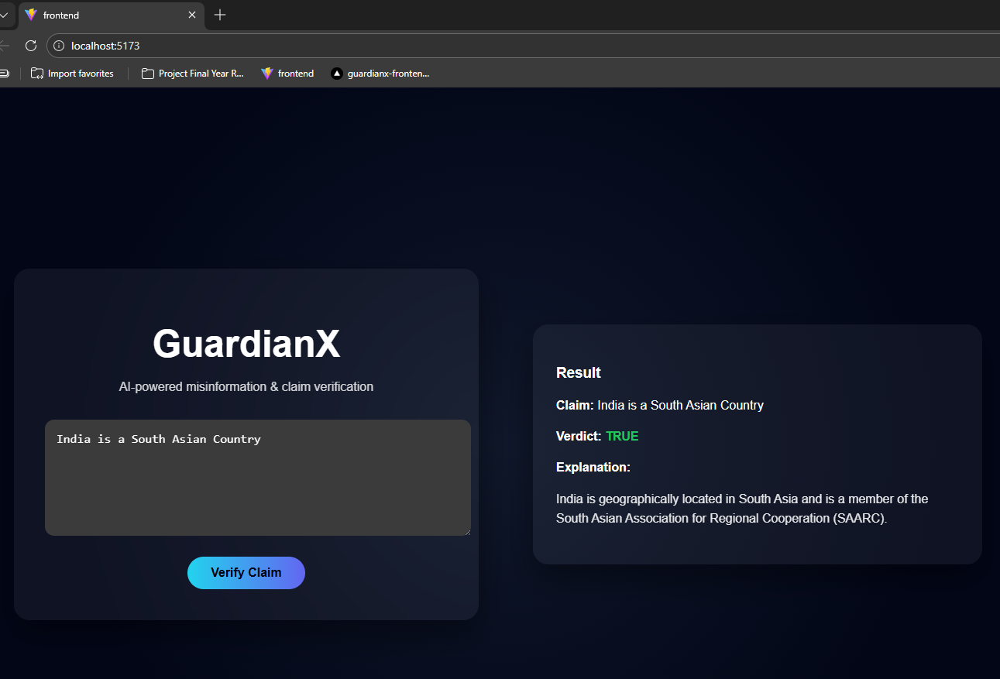
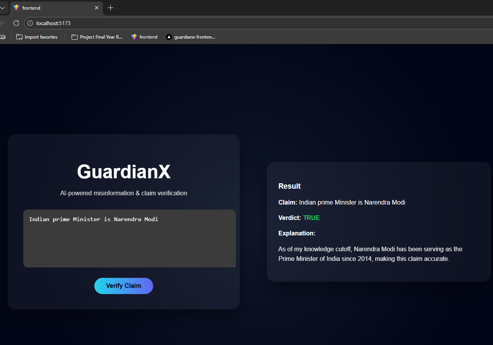

# 🛡️ GuardianX  
### AI-Powered Misinformation & Claim Verification Platform

GuardianX is a clean, responsible, and real-time **AI-based claim verification system** that helps users evaluate the credibility of factual statements with clarity and transparency.

Instead of vague or misleading explanations, GuardianX delivers:
- A **clear verdict**
- **Relevant factual context**
- Explicit handling of uncertainty

Built with a strong focus on **responsible AI usage**, user experience, and hackathon-grade engineering.

---

## 🚨 Problem Statement

Misinformation spreads rapidly across social media, messaging platforms, and online articles.  
Users often encounter claims but have **no simple way to verify them**.

Existing fact-checking solutions suffer from:
- Overly verbose explanations
- Hallucinated or unrelated information
- No clear uncertainty handling
- Poor user experience

---

## 💡 Solution — GuardianX

GuardianX provides a **simple yet powerful fact-verification workflow**:

- 🧠 AI-driven reasoning with strict rules  
- ✅ Clear verdicts: **TRUE / FALSE / MISLEADING / UNKNOWN**  
- 📌 Context-aware explanations only  
- 🚫 No external speculation or hallucination  
- 🎯 Clean, intuitive UI for instant understanding  

If a claim **cannot be verified**, GuardianX explicitly returns **UNKNOWN** — ensuring honesty and transparency.

---

## 🧠 System Architecture (Detailed)

GuardianX follows a **decoupled, scalable architecture** with separate frontend and backend deployments.

### Architecture Highlights
- Frontend and backend are fully decoupled
- Backend enforces strict AI behavior
- Stateless API design → scalable & cloud-ready
- Production-ready deployment model

## Application Screenshots

  

  

